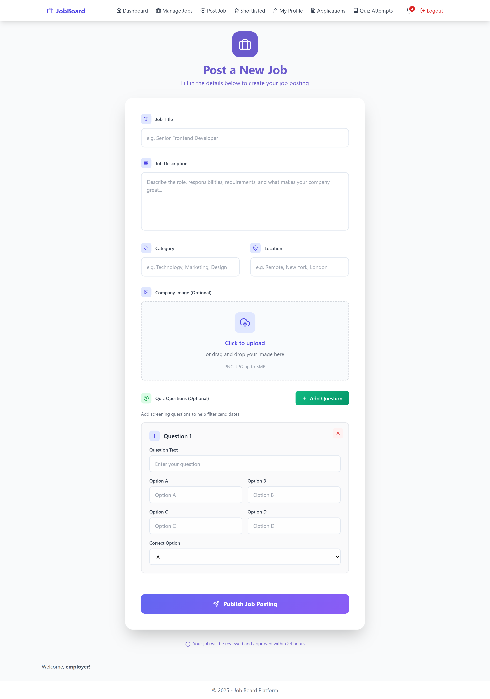
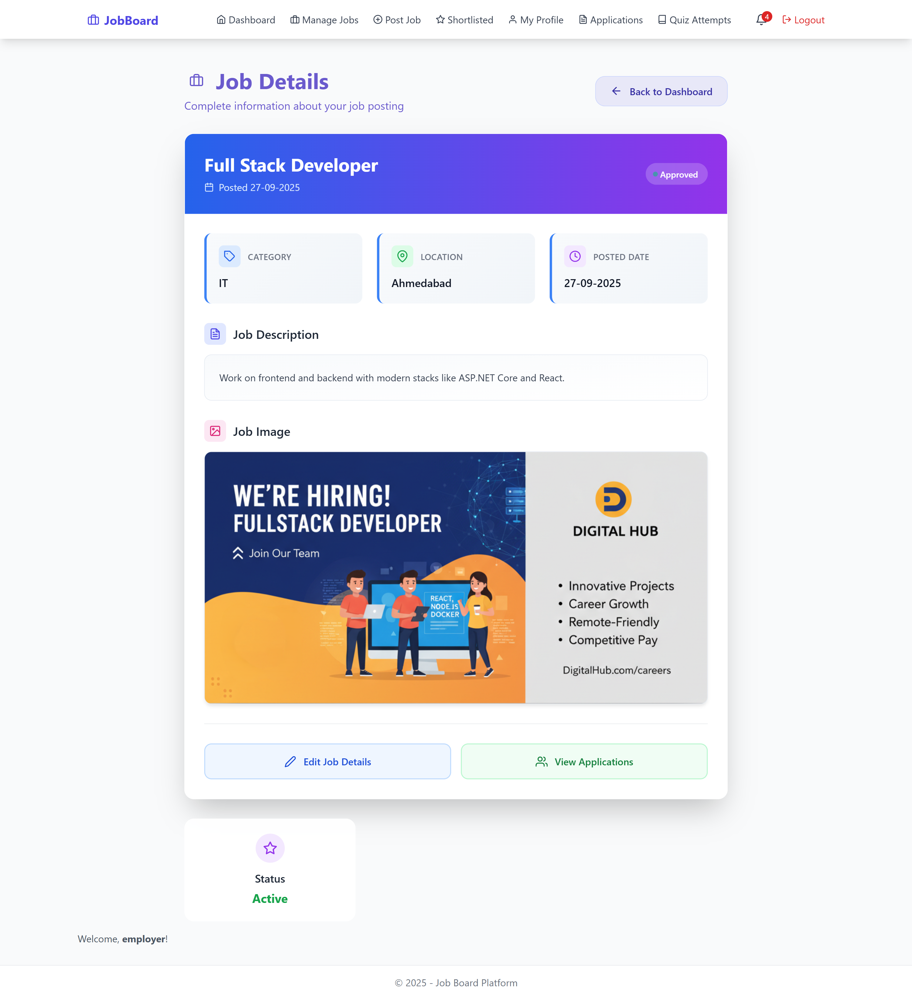

# JobBoardPlatform - Complete Job Board Management System

A comprehensive, full-featured Job Board Management System built using ASP.NET Framework (MVC) with SQL Server (SSMS) as the database. This platform enables seamless interaction between Admin, Employers, and Job Seekers with advanced modules for job posting, application management, analytics, and real-time notifications.

**Developed By:** Vaghela Purvarajsinh

## 🚀 Project Overview
JobBoardPlatform revolutionizes the hiring process by providing a robust, user-friendly platform that connects employers with qualified job seekers. The system streamlines recruitment workflows while offering powerful administrative controls and comprehensive analytics.

## 🎯 Key User Roles & Capabilities

### 👤 Job Seeker Module
- **User Management:** Register, login, and comprehensive profile management
- **Job Discovery:** Advanced search and filtering capabilities
- **Application System:** Apply for jobs with tracking and status updates
- **Interactive Features:** Attempt job-based quizzes (when enabled)
- **Dashboard:** Track applied jobs and receive real-time notifications

### 💼 Employer Module
- **Job Management:** Create, edit, and manage job postings with rich media support
- **Candidate Management:** View, screen, and manage applications
- **Decision Tools:** Approve/reject candidates with automated notifications
- **Analytics:** Comprehensive application statistics and quiz performance analysis
- **Shortlisting:** Advanced candidate shortlisting system

### 👑 Admin Module
- **Content Moderation:** Approve/reject newly created job postings
- **User Management:** Complete control over Employers and Job Seekers
- **Advanced Analytics:** Detailed platform insights and reporting
- **Export Capabilities:** Generate PDF (Rotativa) and Excel (EPPlus) reports
- **System Monitoring:** Real-time notifications for platform activities

## 🛠 Technical Stack

| Component | Technology |
|-----------|------------|
| Frontend | Razor Views, HTML5, CSS3, Bootstrap, Chart.js |
| Backend | ASP.NET Framework (MVC Architecture) |
| Database | Microsoft SQL Server (SSMS) |
| Export Tools | EPPlus (Excel), Rotativa (PDF) |
| Notifications | Custom NotificationHelper.cs |
| Development IDE | Visual Studio |
| Programming Language | C# |

# 📥 Installation & Setup

## Step 1: Clone the Repository
```bash
git clone https://github.com/your-username/JobBoardPlatform.git
cd JobBoardPlatform
```
## Step 2: Open in Visual Studio
- Launch Visual Studio
- Navigate to **File → Open → Project/Solution**
- Select the `.sln` file from the project directory

## Step 3: Database Configuration
1. Open **SQL Server Management Studio (SSMS)**
2. Create a new database (e.g., `JobBoardDB`)
3. Execute the SQL script located in the `/Database` folder
4. Update the connection string in `Web.config`:

```xml
<connectionStrings>
    <add name="JobBoardDB" 
         connectionString="Server=YOUR_SERVER;Database=JobBoardDB;Integrated Security=true;" 
         providerName="System.Data.SqlClient" />
</connectionStrings>
```
## 🔄 Project Workflow

### Job Creation
- **Employer** creates job posting → Notification sent to **Admin**

### Job Approval
- **Admin** reviews and approves/rejects → Job becomes visible to **Job Seekers**

### Application Process
- **Job Seeker** applies → Notification sent to **Employer**

### Candidate Review
- **Employer** approves/rejects application → Notification sent to **Job Seeker**

### Analytics & Reporting
- **Admin** and **Employer** access comprehensive analytics and export reports

### Real-time Notifications
- All users receive instant updates on relevant activities

# 📸 Application Screenshots

## 🔐 Authentication

*User login interface*


*Registration portal*

## 💼 Employer Interface

*Comprehensive employer dashboard*


*Job creation form*


*Job editing interface*


*Job management panel*


*Application review system*


*Complete applications overview*


*Candidate shortlisting interface*


*Quiz performance analytics*


*Detailed job information*


*Employer profile management*


*Notification center*

## 👤 Job Seeker Interface

*Personalized job seeker dashboard*


*Detailed job viewing*


*Job application interface*


*Application tracking system*


*Profile management*


*Notification hub*

## 👑 Admin Interface

*Administrative dashboard*


*Job moderation panel*


*Application management*


*Application review interface*


*Job seeker management*


*Employer administration*


*System notifications*


*Quiz statistics and analytics*

## 🎯 Interactive Features

*Interview scheduling system*


*Interactive quiz interface*

# 📊 Analytics & Reporting

## Advanced Analytics Features

### Chart.js Integration
- Interactive charts for application trends
- Category distribution visualization
- Approval ratios and performance metrics
- Real-time data visualization

### Real-time Statistics
- Live platform activity monitoring
- Instant data updates and refresh
- Dynamic chart rendering
- Real-time dashboard metrics

### Performance Metrics
- **Admin**: Platform-wide insights and user engagement statistics
- **Employer**: Application conversion rates and candidate quality metrics
- **Job Seeker**: Application success rates and profile performance

## Export Capabilities

### PDF Reports
- Professional document generation using **Rotativa**
- Application summaries and candidate profiles
- Financial reports and billing statements
- Platform analytics reports

### Excel Export
- Data export functionality using **EPPlus**
- Bulk candidate data extraction
- Application tracking spreadsheets
- Custom data filtering and sorting

# 🔔 Notification System

## Smart Notification Engine
Built using custom `NotificationHelper.cs` with triggers for:

### Job Creation
- Instant alerts for new job postings
- Real-time notifications to administrators

### Job Approval
- Status updates for job moderation
- Instant feedback to employers
- Publication notifications when jobs go live

### Application Submission
- Real-time application notifications to employers
- Application confirmation to job seekers
- Status tracking updates

### Decision Updates
- Approval/rejection notifications for candidates
- Interview scheduling alerts
- Application status changes

# 🎯 Key Features Deep Dive

## 🔍 Advanced Job Search
- **Keyword-based search functionality** - Intelligent search across job titles, descriptions, and requirements
- **Category and location filtering** - Precise filtering by job categories and geographic locations
- **Salary range and experience level filters** - Targeted search based on compensation and expertise
- **Recent and featured job highlights** - Promoted and newly posted job listings

## 📝 Smart Application System
- **One-click application process** - Streamlined application with saved profiles
- **Resume upload and management** - Support for multiple resume formats and versions
- **Application status tracking** - Real-time updates on application progress
- **Interview scheduling integration** - Built-in calendar integration for interview management

## 📈 Comprehensive Analytics
- **Application trend analysis** - Historical data and pattern recognition
- **Category-wise job distribution** - Market insights by job categories
- **Approval ratio metrics** - Success rate tracking for employers and job seekers
- **User engagement statistics** - Platform usage and activity monitoring

## 🎓 Quiz & Assessment Module
- **Customizable job-based quizzes** - Tailored assessments for specific job roles
- **Automatic scoring and evaluation** - Instant results and performance metrics
- **Performance analytics** - Detailed candidate assessment reports
- **Employer review system** - Side-by-side candidate comparison tools

# 💡 Business Benefits

## For Employers
- **Efficient Hiring** - Streamlined candidate screening and management processes
- **Quality Candidates** - Advanced filtering and assessment tools for better hiring decisions
- **Time Savings** - Automated notification and application management systems
- **Data-Driven Decisions** - Comprehensive analytics and reporting for strategic insights

## For Job Seekers
- **Easy Discovery** - Advanced job search and filtering capabilities
- **Application Tracking** - Real-time status updates and progress monitoring
- **Skill Assessment** - Opportunity to showcase abilities through interactive quizzes
- **Career Management** - Complete profile management and application history tracking

## For Administrators
- **Complete Control** - Comprehensive user and content management capabilities
- **Platform Insights** - Detailed analytics and reporting for platform optimization
- **Quality Assurance** - Job posting moderation and approval system
- **System Monitoring** - Real-time platform activity tracking and management

# 🚀 Future Enhancements

- **Mobile Application Development** - Native iOS and Android apps for on-the-go access
- **AI-Powered Candidate Matching** - Intelligent job-candidate pairing using machine learning
- **Advanced Analytics Dashboard** - Enhanced data visualization and predictive insights
- **Integration with Professional Networks** - LinkedIn and other platform integrations
- **Multi-language Support** - Global reach with multiple language options
- **Advanced Reporting Features** - Customizable and automated reporting tools

# 📞 Support & Contribution

This project demonstrates enterprise-level ASP.NET MVC development with real-world application. For support, feature requests, or contributions:

1. **Fork the repository**
2. **Create your feature branch**
3. **Commit your changes**
4. **Push to the branch**
5. **Create a Pull Request**

# 🏆 Conclusion

JobBoardPlatform represents a modern, complete recruitment solution that showcases the power of ASP.NET MVC and SQL Server in building real-world business applications. With its comprehensive feature set, intuitive user interfaces, and robust backend architecture, it provides a solid foundation for any organization's hiring needs.

⭐ **If you find this project valuable, please consider starring the repository to show your support!**

**Built with ❤️ using ASP.NET MVC** - Demonstrating professional full-stack development capabilities
